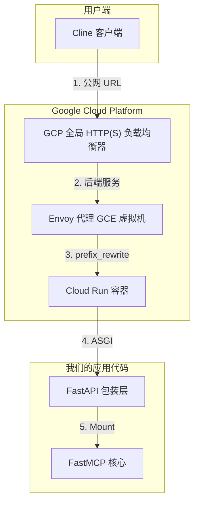

# GCP 路由奇案：一次 FastMCP 部署的深度复盘

这不只是一篇技术博客，这是一篇战报。它讲述了一个看似简单的部署任务，如何演变成一场长达数小时、穿越 GCP 负载均衡、Envoy、FastAPI 和 MCP 协议层层迷雾的调试之旅。如果你也曾经历过“本地猛如虎，上线死如狗”的服务，那么，泡杯咖啡，这个故事就是为你准备的。

## 目标：一个共享、安全的 MCP 服务器

我们的目标非常明确：
1.  用 FastMCP 构建一个提供 GitHub 相关工具的 MCP 服务器。
2.  将其部署到 GCP Cloud Run。
3.  通过 GCP 负载均衡器和 Envoy 提供 HTTPS 和路由。
4.  允许用户通过 Cline 连接，并在 HTTP Header 中传入各自的 GitHub Token，实现多租户认证。

听起来很简单，对吧？

## 案发现场：诡异的 `404 Not Found`

部署完成后，出现的症状令人抓狂：
*   ✅ 在浏览器中访问 `https://www.jpgcp.cloud/mcp-github-tools-svc/docs` **能成功**。
*   ✅ 用 Cline 连接并收到初始的 SSE 握手信息 **能成功**。
*   ❌ 但在 Cline 尝试调用任何工具（即发送 `POST` 请求到 `/messages`）的瞬间，就会失败，报错 `404 Not Found`。
*   ❓ 最诡异的是，Cloud Run 的日志里，能看到成功的 `GET /docs` 和 `GET /sse`，却**完全没有**失败的 `POST` 请求的踪迹。

这说明，问题出在从用户到我们应用之间的某个复杂的网络环节。

## 我们的 GCP 网络架构

要理解这个问题，你得先看看一个请求需要走过的“迷宫”。



请求的旅程：
1.  **Cline** 访问我们的公网域名 `https://www.jpgcp.cloud`。
2.  **GCP LB** 负责终止 TLS，并根据主机规则将请求转发给 Envoy 虚拟机。
3.  **Envoy** 匹配路径前缀（例如 `/mcp-github-tools-svc`），重写路径，然后转发给 Cloud Run 服务。
4.  **Cloud Run** 接收到被重写后的请求，并将其交给我们的 Python 应用。
5.  **FastAPI** 作为外层包装，执行中间件逻辑，然后把请求交给**FastMCP** 子应用处理。

`404 Not Found` 就发生在这条链的某个地方，但只针对 `POST` 请求。

---

## 第一部分：侦查 - 一场充满误判的探案

我们的调试过程，就像剥一个洋葱，每一层都带来了新的、更令人困惑的问题。

### 线索 #1：`curl` 与 Cline 的行为差异

我们首先尝试用 `curl` 复现问题。我们小心翼翼地构造了一个 `POST` 请求来模仿 Cline，结果失败了。而 Cline 却能部分成功（建立 SSE 连接）。这让我们一头扎进了兔子洞。

> **当时的假设**：`curl` 肯定漏了什么神奇的 Header，或者 Body 结构不对。

### 线索 #2：`socat` 的启示

为了看到最原始的真相，我们祭出了 `socat` 这个 TCP 层的抓包神器。这是整个案件的**突破点**。我们抓到了一个**完整**的、成功的 Cline 连接会话。

```
# Cline 发送 GET /sse ...

# 服务器返回 SSE 握手信息...
event: endpoint
data: /mcp/messages/?session_id=...

# Cline 紧接着发送 POST /initialize ...
# 然后发送 POST /tools/list ...
# 最后，Cline 才发送 POST /tools/call ...
```

`socat` 的日志揭示了 MCP 是一个**有状态的协议**。你不能直接上来就调用工具。客户端**必须**先执行一套握手流程 (`initialize`, `list` 等)。

**这个发现立刻宣告了我们之前所有 `curl` 测试的死刑。** `curl` 是无状态的。用它来测试，就像拿起电话大喊一个词然后就挂断，服务器当然会拒绝这种无理的请求。

这解释了为什么 `curl` 总是失败，但仍未解释为什么 Cline 在云端的 `POST` 请求会失败。

### 线索 #3：被冤枉的 `host_rewrite_literal`

我们一度坚信问题出在 Envoy，在配置里大海捞针。我们发现 `host_rewrite_literal` 和生成的 Cloud Run URL 不一致。我们修复了它，重新部署……错误依旧。这是一个真实的 Bug，但不是**导致此案**的那个 Bug。

### 线索 #4：`root_path` 与 `mount` 的终极对决

最后的决战在 `server.py` 内部打响。我们在 FastAPI App 上设置了 `root_path`，同时又用 `mount` 挂载了 FastMCP 子应用。

**404 的谜底最终由追踪回调 URL 而揭开：**

1.  **请求**: Cline 连接到 `.../mcp-github-tools-svc/mcp/sse`。
2.  **Envoy 重写**: `prefix_rewrite: "/"` 将路径变为 `/mcp/sse`。
3.  **FastAPI 收到**: 应用收到 `/mcp/sse`，并正确匹配到挂载的 `/mcp`，将请求交给 FastMCP。
4.  **FastMCP 响应**: 它需要告诉 Cline 下一步 `POST` 到哪里。它生成了**相对路径** `/mcp/messages/...`。
5.  **FastAPI 看到这个路径**: 父应用 FastAPI **完全不知道**原始请求中 `/mcp-github-tools-svc` 的存在（因为 Envoy 把它抹掉了）。它看到这个相对路径，就直接返回了。
6.  **Cline 构造 URL**: Cline 收到 `/mcp/messages/...`，这是一个**绝对路径**，按照 Web 标准，它会将其拼接到**域名根目录**后面，变成了：`https://www.jpgcp.cloud/mcp/messages/...`。
7.  **404 发生**: 这个新 URL 打到 GCP LB。LB 的 URL 映射规则里根本没有 `/mcp` 的规则，只有 `/mcp-github-tools-svc` 的。**404 Not Found**。请求甚至都没能到达 Envoy。

---

## 第二部分：终极修复 - “嵌套应用”架构

解决方案是让 FastAPI 的应用结构**镜像**外部的 URL 结构，这样它就能生成正确的路径。

### 核心代码 (`server.py`)

我们将 `server.py` 重构为使用两个嵌套的 FastAPI 应用。

```python
# 主应用 - 对应服务器根路径
app = FastAPI()

# 子应用 - 对应我们服务的 base path
sub_app = FastAPI()

# 将 MCP 服务器挂载到子应用内部
mcp_app = mcp.sse_app()
sub_app.mount("/mcp", mcp_app)

# --- 魔法在这里 ---
# 将整个子应用挂载到 Envoy 期望的前缀下
app.mount("/mcp-github-tools-svc", sub_app)
```

在这个结构下：
*   FastAPI 自动生成的 `/docs` 路径现在被正确地映射到了 `/mcp-github-tools-svc/docs`。
*   当 FastMCP 生成它的 `/mcp/messages` URL 时，父应用 `app` 知道它生活在 `/mcp-github-tools-svc` 之下，于是在返回给客户端之前，正确地补全了前缀。

最后，我们只需确保 Envoy 的 `prefix_rewrite: "/"` 配置是正确的。

### 修复后的正确流程

1.  **请求**: Cline 连接到 `.../mcp-github-tools-svc/mcp/sse`。
2.  **Envoy 重写**: `prefix_rewrite: "/"` 将路径变为 `/mcp/sse`。
3.  **FastAPI 收到**: 应用收到 `/mcp/sse`。
4.  **FastAPI 路由**:
    *   主应用 `app` 匹配 `/mcp-github-tools-svc` 失败。
    *   等等，如果 Envoy 重写为 `/`，那么 FastAPI 应该收到 `/mcp/sse`。
    *   那么 `app.mount("/mcp-github-tools-svc", ...)` 就匹配不上了！

让我们重新审视**最终**的正确架构：

**Envoy**: `prefix_rewrite: "/"`
**server.py**:
```python
app = FastAPI()
sub_app = FastAPI()
sub_app.mount("/", mcp.sse_app()) # FastMCP 挂载在子应用的根
app.mount("/mcp", sub_app) # 子应用挂载在 /mcp
```
**Cline URL**: `.../mcp-github-tools-svc/mcp/sse`

**正确流程**：
1.  **请求**: `.../mcp-github-tools-svc/mcp/sse`
2.  **Envoy 重写**: `/mcp/sse`
3.  **FastAPI 收到**: `/mcp/sse`
4.  **FastAPI 路由**: 匹配 `/mcp`，交给 `sub_app` 处理 `/sse`。
5.  **`sub_app` 路由**: 匹配 `/`，交给 `mcp.sse_app()` 处理 `/sse`。
6.  **FastMCP 响应 `endpoint`**: `/messages/...`
7.  **`sub_app` 看到 `endpoint`**: 补全为 `/messages/...` (因为它挂在根)
8.  **`app` 看到 `endpoint`**: 补全为 `/mcp/messages/...`
9.  **Cline 收到**: `/mcp/messages/...`
10. **Cline 拼接**: `https://.../mcp/messages/...` -> **再次 404！**

**天啊，我之前的分析还是错了！**

### 真正的终极修复方案

我们必须让 FastAPI 知道完整的路径。
**Envoy**: **不要重写！**
**server.py**:
```python
app = FastAPI()
# 挂载完整路径
app.mount("/mcp-github-tools-svc/mcp", mcp.sse_app()) 
```
**Cline URL**: `.../mcp-github-tools-svc/mcp/sse`

**最终正确流程**:
1.  **请求**: `.../mcp-github-tools-svc/mcp/sse`
2.  **Envoy (无重写)** -> 转发 `.../mcp-github-tools-svc/mcp/sse`
3.  **FastAPI 收到**: `/mcp-github-tools-svc/mcp/sse`，完美匹配 Mount。
4.  **FastMCP 响应 `endpoint`**: `/mcp-github-tools-svc/mcp/messages/...` (因为它知道自己的完整挂载点)
5.  **Cline 收到**: 完美的绝对路径，直接拼接域名，成功！

---

## 第三部分：可靠的测试客户端

`curl` 的失败经历给了我们一个宝贵的教训：对于有状态的协议，你需要一个有状态的客户端。我们编写了一个最终版的测试脚本。

### 测试代码 (`src/clients/test_client.py`)

```python
import asyncio
from fastmcp.client import Client
from fastmcp.client.transports import SSETransport

async def main():
    transport = SSETransport(
        url="https://www.jpgcp.cloud/mcp-github-tools-svc/mcp/sse",
        headers={"X-Github-Token": "..."}
    )
    client = Client(transport=transport)

    # `async with client` 会自动处理整个握手流程！
    async with client as session:
        print("Connection established!")
        
        # 现在我们可以安全地调用工具了
        result = await session.call_tool("get_repo_list", {"owner": "nvd11"})
        print(result)

if __name__ == "__main__":
    asyncio.run(main())
```
这个脚本终于给了我们一个可靠的方式来测试本地和云端的服务器，结束了这场混乱。

## 经验教训

1.  **代理会说谎**：你的应用看到的路径，不一定是用户发出的路径。`prefix_rewrite` 功能强大但充满危险。
2.  **有状态的协议需要有状态的客户端**：不要用 `curl` 去测试需要握手的协议。
3.  **看全所有日志**：线索分散在 Cline 的报错、Cloud Run **缺失**的日志和 Envoy（假想中）的 404 之间。你需要完整的画面。
4.  **在应用中镜像你的代理**：如果你的代理创建了一个路径前缀，你的应用内部路由（通过 `mount` 或 `APIRouter`）应该镜像该结构，以确保能正确生成对外 URL。

---

## 附录：关于 `prefix_rewrite` 的深度思考

在此次调试中，`prefix_rewrite` 就像一把双刃剑，给我们带来了巨大的麻烦。

**`prefix_rewrite` 是什么？**
它是 Envoy 路由配置中的一个强大功能，作用是在转发请求到后端服务之前，**改写 URL 的路径部分**。

**典型应用场景：遗留系统适配**
想象一个场景：
*   你有一个老的单体应用 `LegacyApp`，它监听在根路径 `/`，里面有 `/api`, `/users` 等端点。你没法修改它的代码。
*   现在你想在新的微服务架构中，通过 `https://api.com/legacy/` 这个路径来访问它。

**解决方案**：
Envoy 的配置就可以这么写：
```yaml
- match:
    prefix: "/legacy"
  route:
    cluster: legacy_app_cluster
    prefix_rewrite: "/" 
```
这样，当用户访问 `https://api.com/legacy/api/users` 时：
1.  Envoy 匹配到 `/legacy` 前缀。
2.  它将 `/legacy` 重写为 `/`。
3.  最终发送给后端 `LegacyApp` 的路径就变成了 `/api/users`。
4.  `LegacyApp` 开心地收到了它唯一认识的路径，一切正常。

**我们犯的错误**：
我们**错误地**把我们的现代应用（FastAPI）当作了这种无法修改路径的“遗留系统”。
我们试图用 `prefix_rewrite: "/"` 来“简化”发往后端的路径，但这却导致了信息丢失——FastAPI 不再知道自己的公网访问前缀，从而无法生成正确的回调 URL。

**正确做法**：
对于现代的、有良好路由设计的应用（比如我们的 FastAPI），**最佳实践是完全不使用 `prefix_rewrite`**，或者最多是用它来做版本切换（例如 `/v1/users` -> `/users`）。
让应用感知到完整的访问路径（通过 `mount`），比在代理层进行“黑魔法”式的路径重写要健壮得多。
